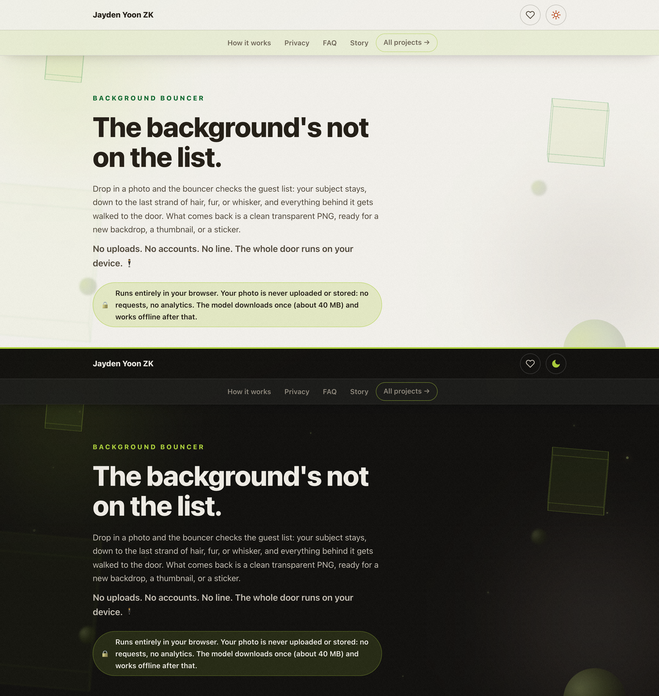

# 🪄 Background Bouncer

**Remove the background from any photo, in your browser. The picture never leaves your device.**

<p>
  <a href="https://jaydenyoonzk.github.io/background-bouncer/"></a>
  <a href="https://github.com/JaydenYoonZK/background-bouncer/actions/workflows/ci.yml"></a>
  <a href="LICENSE"></a>
</p>

<a href="https://jaydenyoonzk.github.io/background-bouncer/">
  
</a>

**[Try it now →](https://jaydenyoonzk.github.io/background-bouncer/)**

Drop in a photo and a neural network lifts the subject out: hair, fur, whiskers and all. What comes back is a clean transparent PNG, ready for a new backdrop, a thumbnail, or a sticker. No uploads, no accounts, no watermarks.

## ✨ What it does

- 🧠 **Finds the subject with a neural network.** BiRefNet, the high-resolution segmentation model from the [Bilateral Reference](https://github.com/ZhengPeng7/BiRefNet) research, re-exported small enough for a browser to run it. It is unusually good at low-contrast edges, a pale hand on pale wood, where lighter models leave a smudge.
- 🪮 **Keeps the fine edges.** A guided filter re-cuts the mask against the full-resolution photo, so single hairs and whiskers survive even though the model works on a 512-pixel canvas.
- 🔍 **Before and after wipe.** Drag a handle to compare the original with the cutout, on a checkerboard or any background color you like.
- 💾 **Transparent PNG out.** One button, full resolution, real alpha.
- 📴 **Works offline.** The model is cached after the first run; after that the whole tool works with the network cable pulled out.

## 🔒 Private by construction

The page's Content Security Policy sets `connect-src 'self'`, so the browser itself refuses any request except the page's own files. Your photo cannot be uploaded, because no upload request can exist. Verify it in your network tab: process a photo and watch nothing leave.

## 🧠 How it works

1. The photo is resized to the model's 512×512 canvas and normalized with ImageNet statistics.
2. BiRefNet paints a probability map: subject or background, per pixel.
3. The map is stretched back over the photo and a guided filter (He et al.) re-attaches it to the photo's real edges at up to 2048 px, which is where hair-level detail comes from.
4. A gentle S-curve snaps near-certain pixels fully solid or fully clear, leaving softness only in the genuine fringe.
5. The alpha plane lands in the original-resolution image and a PNG is encoded.

Inference runs on [ONNX Runtime Web](https://onnxruntime.ai/) (WebAssembly) inside a worker, so the page stays responsive. A photo takes several seconds on a modern laptop, a little longer on a phone.

## 🧪 Development

```bash
npm test        # engine math + site conformance
npm run serve   # serve docs/ on http://localhost:8341
```

The interesting files:

| File | What it is |
| --- | --- |
| `docs/cutout-core.js` | The pure math: box blur, guided filter, matte shaping. Fully unit-tested. |
| `docs/cutout.js` | Model loading (with Cache API), inference, and the PNG pipeline. |
| `docs/app.js` | The page: drop/paste/upload, progress, compare wipe, download. |
| `docs/models/birefnet-lite-512.onnx` | BiRefNet_lite, re-exported at 512×512 and quantized to int8 (81 MB). |

## 📜 Licenses and credits

- Code: [MIT](LICENSE) © Jayden Yoon ZK
- Model: [BiRefNet](https://github.com/ZhengPeng7/BiRefNet) (MIT) by Zheng Peng et al., re-exported to ONNX at 512×512 and quantized to int8
- Runtime: [ONNX Runtime Web](https://github.com/microsoft/onnxruntime) (MIT), vendored in `docs/vendor/`
- Sample photo by Jayden Yoon ZK
